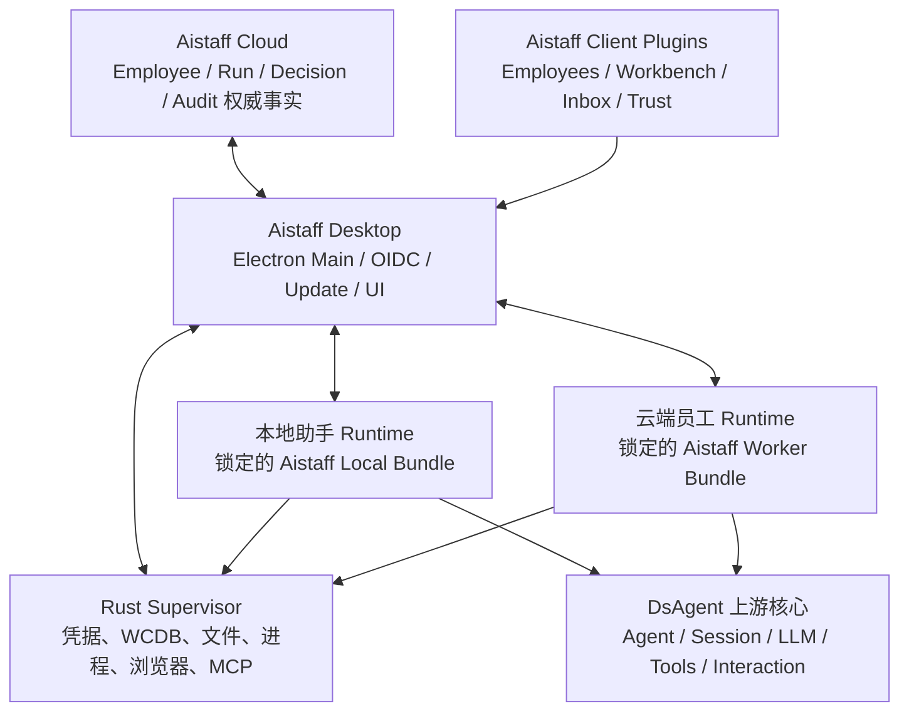

## 结论

这个决策是合理的，而且比继续扩展当前 Aistaff-Client 自研运行时更有长期价值。但必须把它定义成：

> 完整保留 DsAgent 的源码和 Git 历史，以“薄产品 Fork”的方式增加 Aistaff 产品层；运行时按白名单组装，而不是把 DsAgent 默认能力全部开启。

也就是说：

- “完整底座”指完整上游仓库、架构、构建体系和升级血缘。
- 不代表直接使用默认 `base` Profile。默认组合包含 Shell、FS、subprocess、用户插件、动态自修改等高权限能力。
- Aistaff 代码主要新增在独立目录；`packages/core/**`、`vendor/**`、通用 Bundle 应尽量保持上游原样。
- 如果把 Aistaff 业务逻辑直接写进 `agent-loop`、Session 核心或默认 Profile，后续跟进上游的优势会很快消失。

DsAgent 已具备插件、Bundle、Preset、Session、Tool、Client Slot 等扩展机制，适合作为设备执行平面，[架构定义](/Users/baron/projects/DsAgent/docs/architecture.md:9)和[桌面打包方案](/Users/baron/projects/DsAgent/docs/electron-packaging.zh.md:5)都支持这种方向。

## 推荐架构



建议把“本地助手”和“云端员工”分成两个受控运行域。前者可以允许用户主动授权更多能力；后者必须禁止用户插件、动态代码和本地配置覆盖。可以先使用两个独立 DsAgent 子进程实现，不必一开始做每个员工一个进程。

## 事实所有权必须固定

| 数据/动作 | 唯一权威 |
|---|---|
| Tenant、Employee、云 Run、Decision、Audit | Aistaff Cloud |
| 模型消息、工具调用、恢复所需运行事件 | DsAgent Session Log |
| 云任务 inbox/outbox、设备缓存、断网恢复 | WCDB，本地投影而非第二业务真相 |
| 文件、进程、浏览器等 OS 副作用 | Rust Supervisor |
| UI 临时状态 | Renderer |
| 云端员工配置 | 签名且版本化的 Manifest，只引用内置插件 |

云端不能下发任意 JavaScript、Cordis 配置或插件源码。“AI 员工下发”应当是配置下发：Prompt、模型、权限、预算、工具白名单和已安装插件版本。新增代码只能通过签名客户端发布。

## 主要风险和化解方法

### 1. Fork 漂移

Fork 不会自动带来快速升级。如果频繁修改上游核心，升级成本可能比依赖方式更高。

化解：

- `upstream` 只跟踪官方仓库，`origin` 保存 Aistaff 产品线。
- 每次在 `upgrade/<upstream-sha>` 分支合并上游，不逐个 cherry-pick。
- Aistaff 代码集中到新增目录。
- 通用修复单独提交，尽可能回馈上游。
- `vendor/**` 不增加 Aistaff 私有修改。
- 每个不可避免的上游文件修改记录原因、对应上游 Issue/PR 和删除条件。

当前 `/Users/baron/projects/DsAgent` 不是有效 Git 仓库，`git status` 会直接报错。正式实施前必须从官方仓库重新取得完整历史，不能把当前目录直接当作 Fork 基线。

### 2. 生产插件体系可被本地覆盖

现有 DsAgent Profile 支持用户 `cordis.patch.yml`、Home Patch、外部插件、`!!js` 和热加载；Preset 的 `trust` 也只用于展示，不执行权限隔离。[Profile 启动实现](/Users/baron/projects/DsAgent/apps/cli/src/profile-boot.ts:1)明确将用户层放在 Bundle 之后。

生产版需要专用锁定启动器：

- 不加载用户 Profile Patch 和 Home Patch。
- 禁止 `dsh plugin` 安装入口。
- `includeUserRoot: false`，不加载用户 Preset。
- 禁用 `tool-cordis`、动态 Cordis Package 和自修改运行时。
- 禁止直接加载默认本地 FS、bash、subprocess Provider。
- Bundle 使用能力白名单，不使用“默认 base 再逐项禁用”的黑名单方式。

动态扩展内部也明确说明 `node:vm` 不是安全边界，[相关实现](/Users/baron/projects/DsAgent/packages/extensions/cordis-host-runner/src/sandbox.ts:1)不能用于隔离不可信云代码。

### 3. 两套 Session/Run 形成双重事实源

不能把 Aistaff Cloud Run 直接等同于 DsAgent Session，也不能让 WCDB重新实现一套 Session。

需要建立显式关联：

```text
tenantId
deviceId
employeeDeploymentId
cloudTaskId / cloudRunId
dshSessionId
lastSessionEventSeq
leaseToken
idempotencyKey
```

Aistaff 云端 Run 是业务事实；DsAgent Session 是执行事实。二者通过关联表和幂等回执连接。

### 4. 云任务下发不是普通 Prompt 调用

当前 Aistaff 只有 `local_model` 执行适配器，[路由实现](/Users/baron/projects/Aistaff-Client/apps/desktop/src/main/task-routing-service.ts:31)并没有可靠的云端 worker 闭环。

新增 `aistaff-cloud-task` 能力，至少包含：

- 签名 `TaskEnvelope`。
- 本地 durable inbox/outbox。
- claim、lease、heartbeat、cancel。
- 幂等启动和结果提交。
- 重启后根据 `cloudRunId ↔ dshSessionId` 恢复。
- `offered → claimed → running → awaiting_decision → terminal` 状态机。
- 先持久化任务，再启动 Agent，不能直接消费 WebSocket 消息。

### 5. 副作用绕过 Supervisor

DsAgent 默认本地 Provider 可以直接访问文件和进程，这会绕过 Aistaff 已有 Decision/Audit/Grant 体系。

正确方式是：

- 保留 DsAgent 的 FS、subprocess、browser 等 Service Definition/Tool Consumer。
- 新增 Supervisor-backed Provider。
- 所有动作经过 `Decision → Capability Admission → Supervisor → Receipt`。
- 云端权限检查与本地 enforcement 都成功后才能执行。

### 6. 上游数据格式可能破坏兼容

当前版本是 `0.1.0-rc.5`，[package.json](/Users/baron/projects/DsAgent/package.json:1)仍属于开发预览，会话格式没有稳定迁移承诺。

产品侧应：

- 使用独立的 Aistaff Runtime Home，不和普通 `~/.dsh` 共用。
- 每个客户端版本固定一个 DsAgent 基线。
- 升级前保留旧运行时和旧数据的只读副本。
- 对外稳定的是 Aistaff Run/Transcript 投影，而不是 DsAgent 原始文件格式。
- 需要连续恢复时，用旧运行时导出稳定投影，再导入新版本；迁移失败则回滚，不覆盖旧数据。

### 7. 许可证、品牌和发布闭包

DsAgent 主体是 MIT，[LICENSE](/Users/baron/projects/DsAgent/LICENSE:1)允许修改和分发，但不等于获得 DeepSeek 商标或 npm Scope 授权。

- 新增包使用 `@aistaff/*`，不要发布新的 `@deepseek-ai/*`。
- 保留 DsAgent LICENSE、来源、上游 SHA 和本地差异。
- 发行包只包含白名单 Runtime Closure。
- 对 `THIRD_PARTY_NOTICES` 中非标准许可证依赖单独审计，尤其是没有启用但可能被完整打包进去的 Provider。

## 推荐目录

```text
apps/
  aistaff-desktop/
  aistaff-desktop-runtime/

packages/
  aistaff/
    identity/
    cloud-task/
    employee-runtime/
    supervisor/
    runtime-projection/
    channels/
  client/
    ui-aistaff-shell/
    ui-aistaff-employees/
    ui-aistaff-workbench/
    ui-aistaff-inbox/
    ui-aistaff-trust/
  bundle/
    aistaff-local/
    aistaff-worker/
    aistaff-desktop/
```

新增的 `@aistaff/*` 包需要对当前包命名检查增加一个严格限定在 `packages/aistaff/**` 的例外；不要把整个仓库的命名规则放宽。

## Aistaff-Client 能力迁移策略

- 直接迁移并适配：Electron 安全壳、OIDC、设备身份、server-client 生成合同、Supervisor、secureStorage、目录授权、更新验签、Employee/Inbox/Trust 等业务 UI。
- 改造成 DsAgent 插件：Cloud Task、Employee Manifest、Decision Bridge、Channel Adapter、Supervisor Provider。
- 由 DsAgent 替换：`LocalAiService`、OpenAI/Claude 本地 Agent、自建 TaskExecution Agent Loop、本地 AI History。
- 保留服务端权威：Employee、Run、Decision、Audit、Deliverable。
- 暂不迁移：大量 fixture、重复验证 facade、当前未形成真实闭环的 Channel 和 Marketplace 页面。

## 实施顺序

1. 从官方仓库建立可审计 Fork，固定上游 SHA、许可证和升级流程。
2. 建立锁定的 Aistaff Desktop 启动器和白名单 Bundle。
3. 完成一个本地任务：Prompt、流式事件、取消、恢复。
4. 接入一个 Supervisor 只读文件能力，证明无法绕过授权。
5. 接入 OIDC、Employee、Run 的只读链路。
6. 完成一个云任务闭环：下发、租约、执行、取消、结果、重启恢复。
7. 按 Client Slot 迁移 Employees、Workbench、Inbox、Trust UI。
8. 最后完成 IPC Carrier、签名更新、macOS/Windows 安装和升级迁移。

第一个真正的验收切片应同时证明：

- 一个本地任务能够完成。
- 一个云任务能够完成并回执。
- 一个需要权限的文件动作经过 Decision 和 Supervisor。
- 客户端重启后任务状态能够恢复。
- 用户 Patch 或动态插件不能改变云端员工的工具权限。

因此，我支持“完整 DsAgent Fork + Aistaff 插件化产品层”这个决策；但不支持“完整默认运行时 + 在核心中混入 Aistaff 业务代码”。这两个实现方向表面接近，长期结果完全不同。