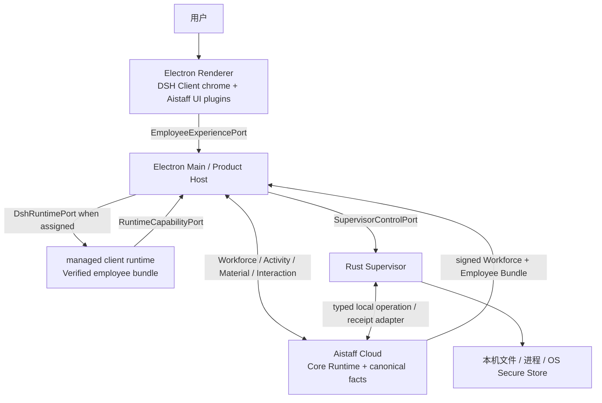

# AiDesktop 架构

> Owner：进程与信任域、代码所有权、插件接入、权限求交和 DSH 上游升级边界。
>
> 跨进程方法与 DTO 见 [API](./API.md)；本地持久化与恢复见 [数据](./数据.md)；阶段与当前入口见 [构建索引](./构建方案.md)。

## 1. 架构目标

AiDesktop 在近原样 DSH Client/Core 上增加一个隔离的 Aistaff 产品插件岛。Aistaff Cloud 拥有 Tenant、Workforce 组合、Employee Release/Bundle、核心 Runtime、Run、Decision、Capability 和 Audit；AiDesktop 只拥有桌面壳、用户可见投影、签名员工包的激活、受管进程装配和本机能力适配；Supervisor 最终执行或拒绝本机副作用。DSH 是服务端可选中的客户端 Runtime 实现，不是所有 AI 员工都必须在客户端运行的产品前提。

产品主干保持“DSH Client 交互基线 + Aistaff Workforce/Employee 投影 + 云端 Activity + Material 展示 + 必要 Interaction”。`client_mode: none` 与 `capability_only` 的 consumer conformance 已贯通正式 object layer、Remote 和 UI；真实 Rust control、加密持久 replay 与 Host process Provider 也已具备，但发布 sidecar 默认不注入 Store key、不声明 control capabilities，桌面 production profile 不装载该链。production 仍只启用 `none`，直到正式 artifact、设备 attestation 与 Cloud Receipt ack/reconciliation 到位。签名 `managed_runtime` 在此后独立验收；本地 Fixture 不成为 Cloud 合同。

## 2. 进程与依赖方向



正式产品中，Renderer 不直连 Supervisor、Cloud 或文件系统。Runtime 的本机能力 Provider 通过 Host Bridge 调用 Supervisor；Host 只路由并映射 DTO，不成为文件/进程副作用 owner。

## 3. 职责与禁止项

| 边界 | 拥有 | 不得拥有 |
| --- | --- | --- |
| Renderer | 上游 Client chrome、产品 Slot 组件、瞬时视图状态、用户意图 | Node API、Secret、设备私钥、绝对路径、云权威状态、直接副作用 |
| Product Host | BrowserWindow/Preload、导航/CSP、交互式 OIDC、Workforce/Engagement 投影、员工包验证与原子激活、版本检查、受管 Runtime/Supervisor 生命周期与 DTO 映射 | 模型循环、直接文件/进程执行、在本地重新组合 Tenant/Industry/Role 源配置、把云 DTO 原样暴露给 Renderer |
| Supervisor | 设备会话、本地 Grant、路径解析、进程/文件效果、Runtime 子进程约束、claim 与 Receipt journal | 产品页面、模型推理、伪造 Cloud Decision/Audit |
| DSH Runtime | 仅在员工包分配时执行 Agent/Tool 编排、模型可见 Session Log 与已裁决 capability | Cloud Tenant 权威、未分配的 Employee 配置、客户绝对路径、原始 Secret、绕过 Supervisor 的资源访问 |
| Aistaff Cloud | Tenant/Industry/Role 配置组合、Workforce Assignment、Employee Bundle/Release、核心 Runtime、Run、Decision、Capability、Audit 和 Desktop Edge 协议 | 客户绝对路径、OS handle、设备私钥、代替本机用户 consent、未经设备 Receipt 证实的本地结果 |

Cordis 插件是组合与生命周期机制，不是安全沙箱。客户版只装载随发布物签名、版本锁定的内建插件；第三方插件、用户 Profile、仓外插件和自修改能力默认关闭。

## 4. 客户端执行形态

| `client_mode` | 核心 Runtime | 客户端职责 | 启用条件 |
| --- | --- | --- | --- |
| `none` | Aistaff Cloud | 显示 Material，回答 Input/Approval | 默认主干，无本机 Runtime |
| `capability_only` | Aistaff Cloud | 经 Local consent 后由 Supervisor 执行一个已声明语义操作 | Cloud Decision/Approval、设备能力、本机 Grant 和当前 policy 的交集 |
| `managed_runtime` | Aistaff Cloud 控制面，分配的执行片段在本机 | 验证并运行签名 Runtime component，提交 Receipt | Workforce assignment、bundle/admission、OS/arch、minimum version、lease/fencing 全部匹配 |

`capability_only` 的 test-only 组合使用 in-memory Supervisor 验收 `Cloud local_operation → 目录选择 → Grant → Local Consent → Receipt → canonical Material refresh`。真实 control runtime 已另行通过 bounded read/list、持久 Receipt 和重启 replay 验收，但发布 sidecar保持休眠，旧 file service 仍返回 `LOCAL_FILE_PRODUCTION_EXECUTION_DISABLED`，两者都不进入桌面 production profile；因此该行的生产启用条件尚未满足。

每个 active Employee Bundle 使用独立的不可变配置视图；受管 Runtime 按 Tenant/设备隔离 Home、Session Store、Credential Scope、Grant 和进程内插件实例。Tenant 切换关闭旧分区的 Runtime 与事件流，不复用旧 Workforce 缓存作为新 Tenant 基线。

只有个人 Local 功能或 `managed_runtime` 明确选择 DSH adapter 时才装配 Locked DSH Runtime Bundle；它只包含 DSH Session、System Prompt、Tool Registry、Agent、Agent Loop、Context、Compaction、Guard、选定 LLM Provider 和必要 Client/API。`client_mode: none` 与 `capability_only` 不因桌面内置 DSH 就启动员工 Runtime。产品启动器使用静态白名单，不从默认开发 Profile 做黑名单删减；未知插件、动态 `!!js`、HMR、自修改、任意 Shell/FS Provider 和 `danger-full-access` 必须在启动时失败。

## 5. DSH 插件接入

### 5.1 UI 组合

产品 UI 继续使用 DSH Client 的 `ctx.slots.register(...)`，不建立第二套 Dashboard Shell，不替换 `root` 或复制 `AppFrame`。当前已冻结的接入方式是：

| 产品表面 | DSH 扩展点 |
| --- | --- |
| Activity/Material/Receipt 对话行 | `conversation.chat.node` keyed renderer |
| Input/Approval/Local operation 交互 | `conversation.composer` chain selector takeover；一请求一 key、一回答一次 |
| Session 上下文与状态动作 | `conversation.session.header.actions` / `utilities` additive entry |
| 产品详情 | 复用上游 Details chrome 与已有 keyed/additive seat；不接管整个 `conversation.details.tool` |
| 账号、设备、AI 员工设置 | 上游 Settings section/item slot |
| Employee/Inbox 导航 | 冻结 DSH 基线中现有 additive Sidebar seat；若缺失，只增加通用可上游化 Slot |

组件只接收四类派生 props share 与纯 DTO/callback；不接触 `ctx`、Cloud SDK、Node API 或 Supervisor 实现。产品业务状态从 Host projection 或 DSH object layer 到达组件；Store 只保存选择、草稿、面板等视图状态。

### 5.2 服务与 Session 事实

浏览器侧产品插件只依赖一个独立正式包拥有的 `EmployeeExperiencePort` service；其 object layer 通过 `observe()` 原子提供初始 snapshot 与 replacement，并持有 Renderer-safe 业务 projection，Slot Store 不镜像这些数据。Product Host 分别适配 Cloud `WorkforceDistributionPort` 和 Supervisor 持有的 `ClientExecutionPort`；每个本机能力仍按 DSH capability seam 提供 Service Definition、Supervisor-backed Provider 和 Tool Consumer，不在 Agent Loop 增加 Aistaff 分支。现有 Task/Approval Fixture Port、projection、Remote 和 Bundle 保持测试岛；production Cloud bundle 不装载它们，也不注册同名 provider。

Local Capability 使用独立 `LocalCapabilityPort` 和完整 replacement；Client bundle 只内联 browser-safe `local-capability/object-layer`，Host coordinator、Supervisor Control 和路径类型不进入 Renderer。两个 Typert Remote 由 `api/remotes` 的唯一 Client assembly 装配。Cloud 与 Local mutation 的 carrier failure 保留原 operation ID 和精确重放输入，先查询 owner；成功的本机读取只经 result sink 进入 canonical Material owner，再由 Employee Experience 完整刷新展示。

Cloud adapter 把已校验的 contract artifact 与 `ClientGatewayTransport` 作为必选组合输入。测试组合可显式注入带固定 hash 和 `test_only` provenance 的 conformance artifact/transport；production Cloud bundle 只接受已 pin 的发布 artifact、正式 transport 与身份配置，任一缺失或不匹配都必须在注册 `EmployeeExperiencePort` provider 前失败。该失败不影响 DSH 默认组合，但不得装载 Fixture provider、调用 Aistaff 内部 API 拼装替代 Gateway，或返回空投影冒充已连接。

只有在个人 Local 或 `managed_runtime` 的 DSH 请求中可见的 Employee/Decision/Grant/Receipt 内容，才必须先成为对应 DSH Session Event 并可由 Session Log 重建；`client_mode: none`/`capability_only` 的模型可见事实由 Aistaff Cloud Runtime 自己记录，客户端不复制。只影响绘制的字段留在 Host projection；Cloud Receipt 与本地 Receipt 可以被受管 Session Event 引用，但 DSH Log 不因此成为 Cloud Audit。

## 6. 工作台与资源身份

`Engagement` 是用户与一个 AI 员工持续协作的展示容器，不是权限、执行目录或 Runtime Session。以下身份不可互换：

| 对象 | Owner | 用途 | 是否授权 |
| --- | --- | --- | --- |
| `EngagementProjection` | Aistaff Cloud owner，AiDesktop Host 缓存 | 聚合 Employee、Activity、Material、Interaction 的可见信息 | 否 |
| `CloudScope` | Aistaff Cloud | Tenant、Employee、Run 等权威引用 | 仅是 Cloud 策略输入 |
| `ExecutionWorkspace` | Runtime Host/Supervisor | DSH Session 的应用自有执行目录 | 只限制运行目录 |
| `ResourceGrant` | Supervisor | Opaque handle、Revision、Intent、Expiry 到真实资源的授权 | 是，本机访问必要条件 |
| `InputMaterial` | Product Host/Cloud Material owner | 一次 Activity 的用户输入快照/引用 | 否，不升级为持续 Grant |
| `DshSession` | DSH Runtime | 模型输入、工具调用和运行事件 | 否，记录已裁决事实 |

Cloud 投影显式映射 `engagement_ref → activity_ref → owner session/invocation/run refs`；只有 `managed_runtime` 才再映射 `execution_ref → dsh_session_id → execution_workspace_handle → grant_handle[]`。这些引用只显式关联，不相互代用；Renderer 不需要看到 run/step/attempt。映射的持久化字段见[数据](./数据.md#4-最小数据模型)。

客户目录永远不是 Managed Session 的 `cwd`。系统选择器得到的路径只在 Host 内存中短暂出现并立即交给 Supervisor；Renderer、模型、普通日志和 Cloud evidence 只看别名、相对段和 Opaque handle。

## 7. 权限与安全边界

Managed 有效权限为：

```text
Cloud Identity/RBAC
∩ Artifact/Capability/Policy/Decision
∩ Local Device/User Grant
∩ Supervisor effect enforcement
∩ Locked Runtime policy
```

独立于 Aistaff 员工的个人 Local 任务可以不经过 Cloud Identity/Decision，但仍需 Grant、Supervisor 与 Locked Runtime；它不是云端 Employee Assignment 的降级执行路径。UI `allowed_actions` 只控制展示，不能作为授权证据；DSH Sandbox/Approval 是纵深防御，不能替代 Cloud Decision 或 Supervisor Grant。

Cloud Approval、Local Consent、Supervisor Grant 与 DSH Tool Approval 是四个独立裁决；它们只通过 subject、revision、proposal/hash 和 Receipt 关联，任何一个成功都不能替代另一个。

每次效果前 Supervisor 重新验证 subject、handle、revision、expiry、intent、相对路径、真实目标身份和当前策略。任何层缺失、过期、冲突或结果不确定都 Fail Closed；已可能发生副作用而失联时返回 `unknown` 并对账，禁止自动重放。

Renderer 固定 `contextIsolation: true`、`sandbox: true`、`nodeIntegration: false`、`webSecurity: true`。Preload 只暴露 [API](./API.md) 定义的方法，不暴露通用 `invoke(channel, payload)`；导航、新窗口、协议和下载均显式白名单。

工程阶段可用 ephemeral Loopback 运行未携带真实客户数据的 DSH Web Client。客户试点前必须切换到 Electron IPC 并通过负向安全验证；UI Slot、稳定 DTO 和 `EmployeeExperiencePort` 不随载体改变。

### 7.1 Electron 封装边界

桌面壳固定 `electron@42.7.0` 并使用 Electron Forge；两者作为版本化依赖采用，不复制或 Fork 源码，实施时在 adoption ledger 与 `THIRD_PARTY_NOTICES.md` 登记实际版本、许可证和本地适配面。`apps/aistaff-desktop` 拥有 Main/Preload、窗口策略、Forge 配置与进程生命周期，`apps/aistaff-desktop-runtime` 是纯生产部署闭包；Electron、DSH snapshot、Runtime manifest、原生模块和产品 Schema 作为一个发布兼容元组。

首个 macOS 本机包使用 [`docs/electron-packaging.md`](../docs/electron-packaging.md) 的 Loopback 拓扑：Main 只以 `process.execPath` 的 Node mode 启动 `process.resourcesPath/runtime` 内的 DSH CLI，固定 Locked Web profile 与端口 `0`，解析唯一的精确 readiness URL 后再打开窗口。它不调用系统 `node`、`pnpm` 或 `dsh`；Main 是 child/process-tree owner，退出、崩溃和升级前必须等待 Host、worker、PTY 与 helper 全部终止。

部署 Runtime、Web bundles、workers、native addons/helpers、presets 和法律文件位于安装资源且首包保持在 ASAR 外；安装目录不可写，任何 workspace link、pnpm-store 路径、符号链接或运行时回退到源码仓都使打包失败。功能依赖的外部 Shell、Git、Python 或编译器若未随包提供，必须在 Locked Bundle 中关闭或显式显示系统前置条件。

Loopback 只用于无真实客户数据的本机交付验证：只接受 `127.0.0.1` 随机端口和精确 ready origin，并继续执行 Host/Origin、导航、新窗口与权限拒绝；这些检查不能认证其他本地进程。客户载体固定为 Electron IPC：`dsh-app://`/allowlisted `dsh-plugin://` 只提供 boot graph 中的资源，CSP 禁止 `unsafe-eval`，Renderer 不执行动态 bundle 文本；Preload 暴露窄端口，Main 校验 sender、frame URL、方法、Schema 与大小，bounded stream 随窗口关闭而取消，且不再监听 API socket。

可写状态只进入[数据定义的 Electron 状态根](./数据.md#31-electron-状态根)，不写 `resourcesPath`。应用更新原子替换 Electron 壳与整套 Runtime；不允许分别更新内置 DSH、插件或原生 helper，也不允许两个应用版本并发打开同一 Runtime Home。

当前 macOS `x86_64` 本机产物只证明该 OS/架构。macOS `arm64`、Windows 和 Linux 必须分别使用目标 Forge maker，重建并加载对应 Electron ABI 的 native addons，验证 helper 权限、进程树关闭、安装目录和平台签名/沙箱；跨平台交叉打包或源码树测试不能替代目标机器安装 smoke。

## 8. DSH 上游与代码所有权

AiDesktop 当前以隔离复制的 DSH 源码作为派生基线；[adoption ledger](../.open-source/adoptions.yaml) 权威记录 `mode=source`、上游精确 Commit、MIT 许可证、上游 URL、采用范围和本地差异。参考工作区不是构建或运行依赖；产品增量仍作为本地插件和适配保留。

产品代码只进入：

```text
apps/aistaff-desktop/          # Electron 产品入口
apps/aistaff-desktop-runtime/  # Locked Runtime 启动器
packages/aistaff/**            # contracts adapter、Host/Runtime bridge、产品 UI、Bundle
```

`vendor/**`、`packages/core/**`、`packages/client/**` 通用 chrome、通用 API/CLI 和 `agent-loop` 默认保持近上游。若产品暴露通用扩展点缺口，只提交最小、无 Aistaff 语义、可上游化的补丁，并记录删除条件；不得用兼容层长期掩盖上游基线漂移。

每个发布物冻结兼容元组：

```text
AiDesktop version
→ Electron 42.7.0 / Forge lock
→ DSH adoption Git ref
→ Aistaff Client Gateway contract artifact version/hash
→ Aistaff Workforce/Employee Bundle contract refs
→ packaged Runtime manifest / target OS-arch
→ DSH Session/SQLite versions
→ desktop_protocol.v1 support
→ desktop_transport.v1 support
→ Supervisor control version
→ Product data version
```

DSH 升级从新的可审计源码候选开始：以 adoption ledger 登记的精确 Commit 到候选 Commit 的范围 diff 审查 Boot/Profile、Session、Client slots、权限、Web carrier 和 Bundle，再重放最小通用补丁并运行产品纵向 smoke。验证完成后才更新台账基线；升级不能自动改变 Cloud wire 或本地数据语义。

## 9. 已冻结决定与决策点

已冻结：

- DSH 采用可审计源码快照并保持薄派生面；产品通过插件/服务/Host Port 接入，不改 Agent Loop。
- 本机个人功能与 Aistaff 分配的 managed runtime 使用独立进程、Home、Credential Scope、Bundle 和 Session Store。
- Aistaff Cloud、DSH Session Log 与 Supervisor 分别拥有企业事实、模型可见事实和本机效果。
- `capability_only` consumer conformance 使用正式 Remote/UI 与 test-only in-memory Supervisor；真实 Rust read/list、Host Provider 与 persistent Receipt 已具备，但 production 在 OS Secure Store data key、正式 artifact/attestation 和 Cloud ack/reconciliation 完成前保持关闭。
- Tenant/Industry/Role 源配置只在 Cloud 组合；客户端只激活已解析、内容寻址、已签名的 Employee Bundle。
- Cloud Client Gateway 按合同 major/minor 与 Feature 协商；服务端内部 Runtime 迭代不改变客户端语义，客户端只声明本机已安装的 capability 和 Runtime adapter。
- 产品包只位于 `apps/aistaff-*` 与 `packages/aistaff/**`；参考仓不形成运行依赖。
- `desktop_transport.v1` 是本地认证 bootstrap，不是 Cloud Task Envelope；Cloud 执行继续消费 `desktop_protocol.v1`。
- Electron 封装是 Web 主干后的独立交付块；本机 Loopback 包不承载真实客户数据，客户版本使用 Electron IPC。
- 安装资源不可写且包含完整 Runtime；目标机器无需外部 Node、pnpm 或 DSH。

实施前关闭的决策点：

| 编号 | 最晚阶段 | 需要的事实 |
| --- | --- | --- |
| A-03 | V2 production | Rust read/list、`SupervisorControlPort` process Provider 与 persistent Receipt 已具备；接入 OS Secure Store data key、正式 artifact/attestation 和 Cloud ack/reconciliation 后才允许激活 |
| A-04 | V3 | Aistaff Desktop Worker 的真实 claim/channel/设备身份入口；当前本地 Schema 不能证明生产 Cloud transport |
| A-05 | V4 | 首发平台、签名/公证/更新服务与回滚支持矩阵 |
| A-06 | 真实 Cloud 接入前 | Aistaff 按 [Client Gateway wire](./API.md#27-cloud-client-gateway-wire) 交付 contract artifact、Workforce/Bundle、Activation Receipt、撤销/kill-switch、Run→Material 与 SSE replay 的 conformance 证据 |

数据加密与保留的未决项由[数据](./数据.md#10-发布阻断项与决策点)持有，不在本文复制。
